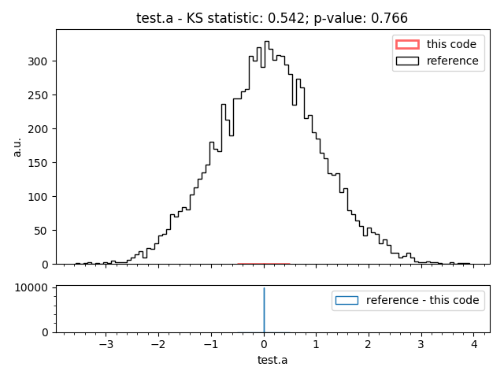

=====
Usage
=====

After installation scikit-validate will provide several commands, all starting with `sv_`:

sv_file_info
----------------------------
The first subcommand will simply record the file size of a given file and record it in a JSON file::

    sv_file_info --help
    Usage: sv_file_info [OPTIONS] [INPUT_FILES]...

    Script to record file metrics.

    For testing pick or create a file:

      # create 10 MB file     dd if=/dev/zero of=test.file bs=10485760
      count=1     sv_add_file_metrics test.file -m metrics.json

    If the output file, default metrics.json, already exists it will be read
    first and results will be appended.

    Options:
    -m, --metrics-file TEXT  file for JSON output
    --help                   Show this message and exit.

sv_execute
-------------------------------
This subcommand will execute the parameters passed to it as a shell command and monitor its resource usage.
At the moment only (simple) CPU time and RAM usage are supported::

    sv_execute --help
    Usage: sv_execute [OPTIONS] COMMAND

      Command that wraps and monitors another command.

      For testing install 'stress' package and run

          sv_execute 'stress --cpu 1 --io 1 --vm 1 --vm-bytes 128M --timeout 10s --verbose' -m resource_metrics.json

      If the output file, default resource_metrics.json, already exists it will
      be read first and results will be appended.

    Options:
      -m, --metrics-file TEXT
      --help                   Show this message and exit.

sv_get_artifact_url
-----------------------------
Reads the ENV variable in a Gitlab CI job and constructs a URL for a given existing file or folder.

e.g.::

    sv_get_artefact_url output/test_file

will return :code:`${CI_PROJECT_URL}/-/jobs/${CI_JOB_ID}/artifacts/file/output/test_file`

while::

    sv_get_artefact_url output

will return :code:`${CI_PROJECT_URL}/-/jobs/${CI_JOB_ID}/artifacts/browse/output`

sv_get_target_branch
-----------------------------
Script to extract the target branch for a given project and commit hash.

Meant to be run within a Gitlab CI job and needs the following ENV variables defined:
 * CI_PROJECT_ID (automatic from CI job)
 * CI_COMMIT_SHA (automatic from CI job)
 * CI_API_TOKEN (to be set in the Gitlab project: settings -> pipelines -> add variable)

Related issue: https://gitlab.com/gitlab-org/gitlab-ce/issues/15280

sv_merge_json
-----------------------------
Merges dictionaries in <N>JSON files into one output file. Uses dict.update() |srarr| last occurrence of a key will take precedence.
Usage::

    sv_merge_json [OPTIONS] [INPUT_FILES]... OUTPUT

sv_remove_from_env
-----------------------------
Removes a path from an environment variable, e.g. ::

    sv_remove_from_env /a/b/c:/a/b/d:/d/b/a /a/b

will result in `/d/b/a`. Recommended use is to clean up ENV variables::

    PATH=`sv_remove_from_env /a/b/c:/a/b/d:/d/b/a /a/b`

sv_root_diff
--------------------
Calculates the difference between two ROOT (https://root.cern.ch/) files.
If a difference is present, the command will create plots for the distributions that differ.::

    sv_root_diff file_under_test reference_file --out-dir <path to output folder (for plots etc)>

Example output 1 - `test.a` only exists in the reference file:

Example output 2 - `test.y` exists in both, but different random seed:

   .. image:: _static/root_diff/test.y.png
      :target: _static/root_diff/test.y.png

run-clang-tidy
--------------
From https://github.com/llvm-mirror/clang-tools-extra/blob/master/clang-tidy/tool/run-clang-tidy.py

Runs clang-tidy in parallel for the code base::

    run-clang-tidy <path to code base>

.. |srarr|    unicode:: U+02192 .. RIGHTWARDS ARROW
